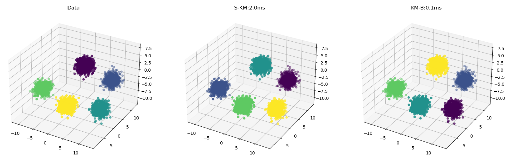
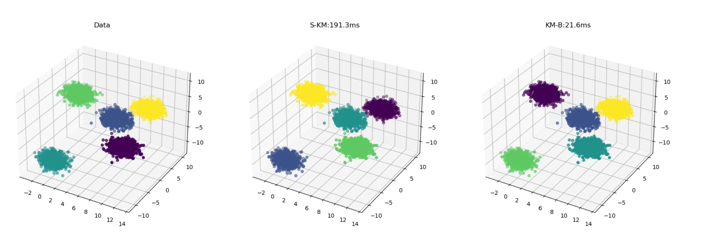
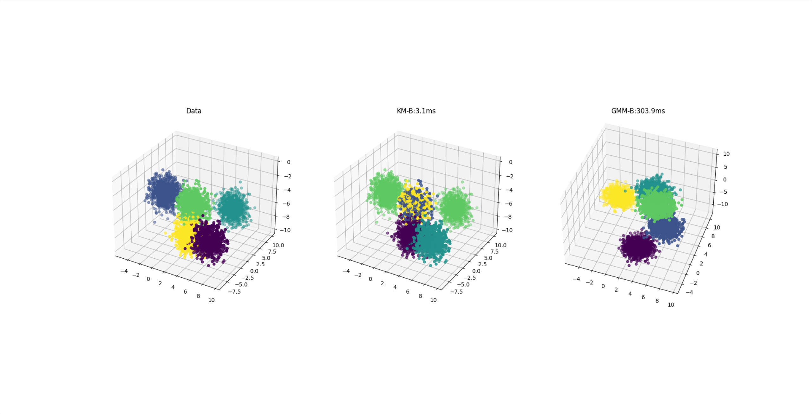

# Implementation of the batch k-means with PyTorch

To cluster large amounts of data with K-Means, accelerated by GPU.

- Data: 500000x3 K=5

	

- Data: 50000000x3 K=5 

	

To cluster large amounts of data with Gaussian Mixture Model, accelerated by GPU.

- Data: 100000x512 K=5

	

 